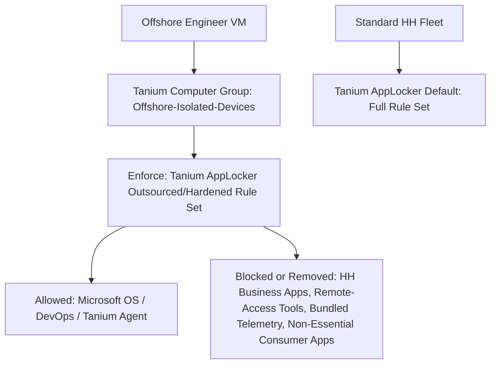

# AppLocker-Isolation

# Tanium Offshore Engineer Isolation & AppLocker Hardening

*A real-world endpoint isolation project. Hummingbird Healthcare IT.*

---

## Project Summary

Hummingbird Healthcare engaged an offshore contract engineer to work in an isolated development environment. As a HIPAA-regulated healthcare organization, HH required that this external engineer be granted a fully isolated build environment with zero visibility into, and zero access to, internal HH infrastructure, tooling, or business applications, while still retaining the Microsoft and DevOps tooling required to do the job.

This project covers the endpoint-level isolation and application-control (AppLocker) hardening work I designed and implemented in Tanium to enforce that boundary technically, not just procedurally. This turned a security requirement into an auditable, enforced configuration.

**My role:** Designed and built the Tanium targeting architecture, cloned and hardened the AppLocker policy, and drove the rule-by-rule risk classification that was later reviewed with the security engineering lead ahead of sign-off.

---

## Objective

Ensure the offshore engineer's assigned VM can only run the software required for legitimate build and development work (OS baseline, Microsoft tooling, DevOps utilities), while being provably excluded from every internal HH business application, remote-access tool, and company-branded software package, with the isolation enforced by policy, not by trust.

---

## Environment & Constraints

| Item | Detail |
|---|---|
| Target endpoint | Isolated Azure Virtual Desktop VM (offshore engineer) |
| Domain status | WORKGROUP, not domain-joined to HH AD/Entra |
| Network | Internal HH enterprise address space (private RFC 1918 range) |
| Policy engine | Tanium: Enforce > Policy Configurations module (Tanium's GPO-equivalent, machine-level config enforcement layer) |
| Related identity control | Pre-existing Entra ID Security group for VDI engineers, built separately by the identity team for identity and access scoping. This is a distinct system from the Tanium targeting scope this project covers |
| Compliance driver | HIPAA. Offshore and third-party personnel must not have a technical path to PHI-adjacent systems, internal SharePoint, Fabric, or HH business apps |

---

## Architecture & Approach

The isolation boundary was built in three independent layers, so that a failure or misconfiguration in any single layer would not silently expose HH internal systems.

### Design decisions and rationale

1. **Static (non-filter) Computer Group over dynamic/filter-based targeting.** A dynamic group re-evaluates membership continuously against criteria like OS version, OU, or tags. For an isolation boundary, that is a liability: a future tag or attribute match could silently pull an unrelated HH machine into the offshore-scoped policy, or vice versa. A manually bound static group eliminates that failure mode entirely, since membership only changes when a human explicitly edits it.

2. **Clone-then-strip over edit-in-place.** The source policy (HH AppLocker Default) was left completely untouched. All hardening work was performed on a duplicate policy. This guarantees zero risk of an in-progress edit affecting the roughly 300-endpoint production fleet mid-change.

3. **Explicit exclusion, not implicit non-targeting.** The offshore VM was explicitly removed from the original policy's targeting scope, not just added to the new one. Two overlapping AppLocker policies enforcing conflicting rule sets on the same endpoint produces undefined, unpredictable behavior in practice. Explicit exclusion prevents that dual-policy conflict.

4. **Naming convention correction mid-project.** The initial Computer Group name mirrored the unrelated Entra ID Security Group naming convention. I renamed it to a generic isolated-devices name to avoid implying a relationship between two unrelated systems (the Tanium Computer Group and the Entra ID Group), and to generalize the name so it scales cleanly if additional offshore engineers are added later.

---

## Step-by-Step Implementation Log

### Phase 1: Isolation Boundary (Tanium Computer Group)

| Step | Action | Technical Detail |
|---|---|---|
| 1.1 | Created static Computer Group | Renamed from an initial hostname-specific name to a generic isolated-devices name. Filter evaluation disabled, confirming manual/static membership, not rule-evaluated |
| 1.2 | Bound endpoint manually | Manual group membership added by exact hostname match |
| 1.3 | Validated endpoint identity | Cross-checked hostname against the Endpoint Overview page to rule out a naming mismatch before trusting the binding |
| 1.4 | Confirmed domain status | Confirmed WORKGROUP: the endpoint is not domain-joined, which reduces (but does not eliminate) the intended domain-scoped policy content |
| 1.5 | Verified group resolution | Initial preview returned 0 of 0 members. Diagnosed as a normal Tanium sensor/heartbeat evaluation-cycle lag, not a config error. Re-checked after refresh and resolved to 1 of 1 members, 100 percent |

### Phase 2: Policy Layer Discovery

| Step | Action | Technical Detail |
|---|---|---|
| 2.1 | Ruled out the Deploy module | Reviewed all active deployments (22 items, 278 to 312 endpoints each). Confirmed these are software-push jobs, not machine config policies, and irrelevant to the enforcement task |
| 2.2 | Ruled out the Comply module | Confirmed this module governs compliance benchmark scoring (CIS/NIST-style), not enforceable machine configuration |
| 2.3 | Located the correct module | Enforce > Policy Configurations. Confirmed with the security engineering lead as the correct layer. This is Tanium's functional equivalent of a Windows GPO, hosting BitLocker, Microsoft Defender (MDE/ASR), Firewall, AppLocker, and USB control policies |

### Phase 3: Policy Clone & Targeting

| Step | Action | Technical Detail |
|---|---|---|
| 3.1 | Cloned the source policy | Duplicated the HH AppLocker Default policy into a new "Outsourced" policy (Windows Policy type). Source policy left fully intact and unmodified |
| 3.2 | Scoped new policy targeting | Set the Computer Group target to the isolated-devices group. Confirmed the endpoint was present under Cached Endpoints |
| 3.3 | Excluded target from source policy | Removed the offshore endpoint from the HH AppLocker Default targeting scope, to prevent overlapping enforcement and stop standard HH rules from reaching the isolated endpoint |
| 3.4 | Verified non-overlapping enforcement | Confirmed via the Targeting tab on both policies: source policy targets everyone minus the explicit exclusion, outsourced policy targets the isolated-devices group only, an explicit endpoint match with no overlap |

### Phase 4: Executable Rule Set Hardening (Attack Surface Reduction)

Rule-by-rule risk classification applied a single governing principle: retain only OS and Microsoft-signed paths, the Tanium agent, and DevOps build tooling rules. Remove everything tied to HH business collaboration, remote-access tools, non-essential consumer software, and vendor-bundled telemetry components.

**Removed: HH internal business apps** (highest-priority strip, since these carry direct data-exposure risk if left reachable)
- ERP software, HRIS studio and publisher tools, BI/analytics software

**Removed: HH-branded collaboration and remote-access tooling**
- Remote support/screen-share tools, video conferencing client paths, screen recording software

**Removed: HH tenant-specific utilities**
- Password management tooling, contact center software installers, e-learning authoring tools, domain-login support utilities (mostly moot on a non-domain-joined endpoint), corporate SSE proxy client

**Removed: vendor-bundled telemetry and social-integration junk** (came in bundled with a hardware driver package, with no legitimate build purpose)
- Assorted social media API wrapper components (YouTube, X/Twitter, Facebook, and similar bundled wrappers)

**Removed: non-essential consumer and general-purpose software**
- Non-standard browsers and browser updaters, screen capture utilities, video/audio recording software, and one unrelated leftover entry from a personal creative app, flagged separately as unrelated to the source policy
- An attention-tracking/analytics utility, flagged as inappropriate for any contractor-facing machine

**Retained by design (do-not-touch categories)**
- Microsoft-signed core OS paths
- Microsoft Office components
- Tanium agent and publisher certificate (required, since this is the enforcement mechanism itself)
- DevOps and build tooling (WSL, Microsoft SDKs, cURL, code editors, Terraform, and similar)
- Hardware/driver vendor file rules (left in place intentionally, given low residual risk on a non-domain-joined VM and limited cleanup value at this stage)

### Phase 5: Items Escalated for Security Review (Not Unilaterally Stripped)

Several rules were deliberately not removed without an explicit decision from the security engineering lead, because removal or retention is a security-posture call, not a cleanup call.

| Rule | Risk Consideration |
|---|---|
| EDR/AV agent | Removing it leaves the VM with no endpoint protection. This is a compensating-control decision, not a cleanup one, and was the top item for security sign-off |
| Cloud storage client | Non-Microsoft storage on an externally-operated, isolated machine is a potential data-exfiltration path |
| FTP client | Could be a legitimate deployment tool on an outsourced build machine. Requires explicit business justification |
| Java/JDK tooling | Retention depends entirely on the engineer's actual build stack |
| VPN client (ambiguous entry) | Needed confirmation of whether this governs a VPN client still required for the job, distinct from the already-removed video conferencing client |
| Unclear-purpose publisher entry | Ambiguous purpose from the name alone. Not removed blind, pending confirmation |

---

## Outcome

The offshore engineer's VM now runs on an independently maintained AppLocker policy, scoped to a dedicated, statically bound Computer Group, with zero targeting overlap against the production HH fleet policy. Every removed rule was classified against a single retention principle rather than removed ad hoc, and every ambiguous or higher-risk rule was escalated for an explicit decision instead of being unilaterally stripped or left in place by default.

## What This Demonstrates

- Designing an enforcement boundary across independent layers, so a single misconfiguration cannot silently break isolation
- Translating a compliance requirement (HIPAA-driven third-party access control) into an auditable technical control
- Methodical, rule-by-rule risk classification rather than bulk allow/deny decisions
- Knowing when to escalate a security-posture call instead of making it unilaterally
- Clear technical documentation that another engineer (or an auditor) could pick up and follow
