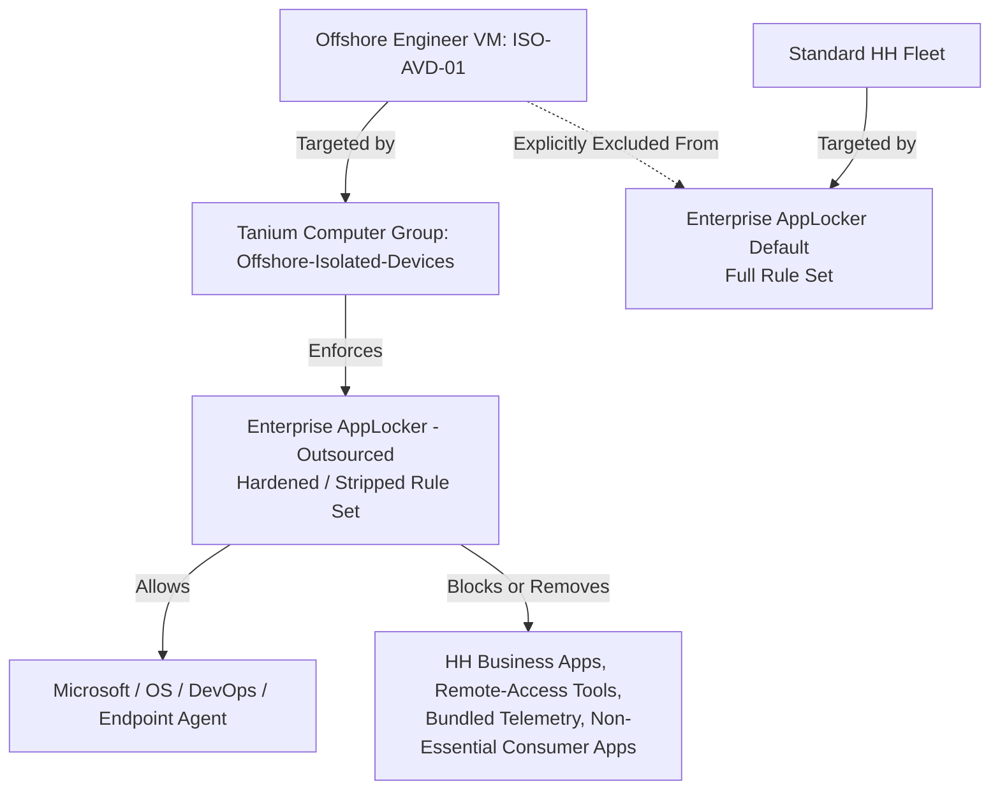

# Tanium Offshore Engineer Isolation & AppLocker Hardening
### A Real-World Endpoint Isolation Project, Hummingbird Healthcare IT

---

## Project Summary

Hummingbird Healthcare brought on 1 to 3 offshore contract engineers to work in an offshore development environment. Since HH is a HIPAA-regulated healthcare organization, these external engineers needed a fully isolated build environment with zero visibility into, and zero access to, internal HH infrastructure, tooling, or business applications. At the same time, they still needed the Microsoft and DevOps tooling required to actually do their job.

This project covers the endpoint-level isolation and application-control (AppLocker) hardening work I designed and implemented in Tanium to enforce that boundary technically, not just on paper. The goal was to turn a security requirement into an auditable, enforced configuration, something that could stand up to a security review, not just a policy statement in a document nobody checks against reality.

**My role:** I designed and built the Tanium targeting architecture, cloned and hardened the AppLocker policy, and drove the rule-by-rule risk classification that was later reviewed with the security engineering lead before sign-off.

> *Note on detail level: hostnames, group names, policy names, and vendor products in this write-up have been generalized to their functional category. The architecture, decisions, and reasoning are unchanged from the real implementation.*

---

## Why This Project Matters

Bringing in offshore or third-party engineers is a common and often necessary business decision, but it creates a real compliance exposure for a healthcare organization: any technical gap between "the contract says isolated" and "the endpoint is actually isolated" becomes an audit finding, or worse, a genuine PHI exposure path.

This project closes that gap. Instead of relying on trust, a contract clause, or a one-time manual check, the isolation boundary is enforced continuously at the endpoint level, in both directions (the offshore VM can't reach HH's internal tooling, and HH's standard fleet policy can't accidentally apply to the offshore VM). It's the difference between *documented* security and *enforced* security, and it's built in a way that scales cleanly to the next offshore engineer without re-doing the work from scratch.

---

## Objective

> Make sure the offshore engineer's assigned VM (`ISO-AVD-01`) can only run the software needed for legitimate build and dev work (OS baseline, Microsoft tooling, DevOps utilities), while being provably locked out of every HH-internal business application, remote-access tool, and company-branded software package. The isolation needed to be enforced by policy, not by trust.

---

## Environment & Constraints

| Item | Detail |
|---|---|
| Target endpoint | `ISO-AVD-01` (Azure Virtual Desktop VM) |
| Domain status | `WORKGROUP`, not domain-joined to HH AD/Entra |
| Network | Internal HH enterprise address space (private RFC 1918 range) |
| Policy engine | Tanium, Enforce > Policy Configurations module (functionally equivalent to a Windows GPO: a machine-level config enforcement layer) |
| Related identity control | A pre-existing Entra ID security group for VDI engineers (built separately by the security engineering lead for identity and access scoping; a distinct system from the Tanium targeting layer this project covers) |
| Compliance driver | HIPAA. Offshore and third-party personnel can't have a technical path to PHI-adjacent systems, internal SharePoint, Fabric, or HH business apps |

---

## Architecture & Approach

I built the isolation boundary in three independent layers, so a failure or misconfiguration in any single layer wouldn't quietly expose HH's internal systems. Defense-in-depth at the endpoint level, not a single point of failure.

### Design Decisions and Rationale

1. **Static (non-filter) Computer Group instead of dynamic/filter-based targeting.** A dynamic group continuously re-evaluates membership against criteria like OS version, OU, or tags. For a security isolation boundary, that's a liability rather than a convenience: a future tag or attribute match could quietly pull an unrelated HH machine into the offshore-scoped policy, or just as easily drop the offshore VM back out of isolation without anyone noticing. A manually-bound static group eliminates that failure mode entirely, membership changes only when someone deliberately edits it, which means the isolation boundary can't silently drift over time.

2. **Clone-then-strip instead of editing the production policy in place.** I left the source policy (`Enterprise AppLocker Default`) completely untouched and did all the hardening work on a duplicate (`Enterprise AppLocker - Outsourced`). This is standard change-management discipline: it guarantees zero risk of an in-progress edit affecting the roughly 300-endpoint production fleet mid-change, and it gives a clean rollback path if anything about the new policy needs to be revisited.

3. **Explicit exclusion, not just leaving the endpoint untargeted.** I removed `ISO-AVD-01` from the original policy's targeting scope rather than simply adding it to the new one and assuming that was sufficient. Two overlapping AppLocker policies enforcing conflicting rules on the same endpoint produce unpredictable results in practice (Windows doesn't guarantee a clean "most restrictive wins" outcome). Explicit exclusion removes that ambiguity entirely, there is exactly one AppLocker policy in effect on this endpoint, and it's the one I built for this purpose.

4. **Naming convention fix, caught and corrected mid-project.** The initial name was hostname-specific and mirrored the naming convention already in use for an unrelated Entra ID Security Group. Left as-is, that would have implied a dependency or relationship between two systems that don't actually interact, the Tanium Computer Group and the Entra Security Group serve entirely different control planes (device targeting vs. identity/access). I renamed it to `Offshore-Isolated-Devices`, which also scales cleanly: it doesn't need to be renamed every time a new offshore engineer is onboarded, because it's scoped to a category of device rather than one specific hostname.

---

## Step-by-Step Implementation Log

### Phase 1: Isolation Boundary (Tanium Computer Group)

| Step | Action | Technical Detail |
|---|---|---|
| 1.1 | Created static Computer Group | Name: `Offshore-Isolated-Devices` (renamed from an initial hostname-specific name). Enable Filter is disabled, confirming manual/static membership, not rule-evaluated |
| 1.2 | Bound endpoint manually | Manual Group Membership: `ISO-AVD-01` added by exact hostname match |
| 1.3 | Validated endpoint identity | Cross-checked hostname against the Endpoint Overview page to rule out a naming mismatch (trailing characters/casing) before trusting the binding |
| 1.4 | Noted domain posture | Confirmed Domain Name: `WORKGROUP`, endpoint is not domain-joined, which reduces (but doesn't eliminate) inherited domain-scoped policy content |
| 1.5 | Verified group resolution | Initial preview came back 0 of 0 members. Diagnosed as a normal Tanium sensor/heartbeat evaluation-cycle lag, not a config error. After refreshing it resolved to 1 of 1, IP address within the private RFC 1918 range, 100% |

### Phase 2: Policy Layer Discovery

| Step | Action | Technical Detail |
|---|---|---|
| 2.1 | Ruled out Deploy module | Reviewed all active deployments (22 items, 278 to 312 endpoints each). Confirmed these are software-push jobs, not machine-config policies. None matched an isolated/narrow-scope use case |
| 2.2 | Ruled out Comply module | Confirmed this module handles compliance benchmark scoring (CIS/NIST style), not enforceable machine configuration |
| 2.3 | Located correct module | Enforce > Policy Configurations. Confirmed with the security engineering lead as the correct layer. It's Tanium's functional equivalent of a Windows GPO, hosting BitLocker, Microsoft Defender (MDE/ASR), Firewall, AppLocker, and USB control policies |

### Phase 3: Policy Clone & Targeting

| Step | Action | Technical Detail |
|---|---|---|
| 3.1 | Cloned source policy | Duplicated `Enterprise AppLocker Default` into `Enterprise AppLocker - Outsourced` (Policy Type: Windows Policy). Source policy left fully intact and unmodified |
| 3.2 | Scoped new policy targeting | Set Computer Group target to `Offshore-Isolated-Devices`. Confirmed `ISO-AVD-01` shows up under Cached Endpoints |
| 3.3 | Excluded target from source policy | Removed `ISO-AVD-01` from `Enterprise AppLocker Default`'s targeting scope to prevent dual-policy rule conflicts and keep standard HH rules from reaching the isolated endpoint |
| 3.4 | Verified non-overlapping enforcement | Checked the Targeting tab on both policies: source policy targets unrestricted/Everyone minus the explicit exclusion, outsourced policy targets `Offshore-Isolated-Devices` plus the explicit endpoint match only |

### Phase 4: Executable Rule Set Hardening (Attack Surface Reduction)

I went rule by rule using one governing principle: keep only OS/Microsoft-signed rules, the endpoint management agent, and DevOps build tooling. Remove everything tied to HH business systems, HH-branded collaboration and remote-access tools, non-essential consumer software, and vendor-bundled telemetry.

**Removed, HH internal business systems** (highest-priority strips, direct data-exposure risk if left reachable):
- ERP platform, HRIS suite (studio + publisher components), BI/analytics platform

**Removed, HH-branded collaboration & remote-access tooling:**
- Remote support and screen-share clients (2 products), unified communications client, VDI conferencing client path, screen recording software

**Removed, HH tenant-specific utilities:**
- Password/credential manager (2 entries), contact-center platform components (3 entries), e-learning authoring tool, domain logon-script utility (moot on a non-domain-joined VM), corporate SSE/proxy client

**Removed, vendor-bundled telemetry/social-integration junk** (came in with a hardware driver package, no legitimate build purpose):
- Assorted social-media API wrapper components (video, microblogging, streaming, image-service, and regional social platform wrappers)

**Removed, non-essential consumer/general-purpose software:**
- Non-standard browsers and browser updaters, screen capture utilities (3 entries), broadcast/recording software, a secondary-display utility, a personal crafting application (a leftover entry naming an individual user, flagged separately as unrelated cruft in the source policy), and an attention-tracking/analytics utility flagged as inappropriate for any contractor-facing machine

**Retained by design (do-not-touch categories):**
- Microsoft-signed core OS paths (`SYSTEM32`, `%WINDIR%`, `APPDATA`, `WINDOWSAPPS`), Microsoft Office components, endpoint management agent + publisher rules (required, this is the enforcement mechanism itself), DevOps/build tooling (WSL, Microsoft SDKs, cURL, terminal emulators, code editors, Terraform)
- Physical hardware driver rules (chipset, audio, GPU vendors), intentionally left in place. Low residual risk on a cloud VM, not worth the cleanup effort at this stage

### Phase 5: Items Escalated for Security Review (Not Unilaterally Stripped)

A handful of rules I deliberately did not remove without an explicit decision from the security engineering lead, because removal or retention here is a security-posture judgment call, not just a cosmetic cleanup. Knowing which decisions are mine to make and which ones need a second set of eyes is itself part of doing this work responsibly.

| Rule | Risk Consideration |
|---|---|
| EDR/AV agent | Removal leaves the VM with no endpoint protection. This is a compensating-control decision, not a cleanup item. Top priority for security sign-off |
| Non-Microsoft cloud storage sync client | Third-party storage on an externally-operated, isolated machine. Potential data-exfiltration path |
| FTP client (2 entries) | Could be a legitimate deployment tool or an exfil risk. Requires explicit business justification |
| Java runtime / JDK / IDE tooling | Retention depends entirely on the engineer's actual build stack |
| Ambiguous vendor entry (distinct from the already-removed UC client) | Needs confirmation on whether this governs the VPN client, which may still be required |
| Unpinned publisher rule | Ambiguous purpose from the name alone, not removed blind |
| SaaS project/task-tracking platform | Possible legitimate PM/task-tracking need for contractor coordination |
| Unidentified AppData hash rule | No identifiable purpose from metadata, flagged rather than guessed on |

---

## Testing & Validation Plan

- [ ] Live walkthrough with the security engineering lead to confirm final disposition on all "escalated" items above
- [ ] Functional validation on `ISO-AVD-01`: confirm all retained DevOps tooling launches correctly under the hardened policy
- [ ] Negative-path validation: confirm blocked HH business apps (ERP, HRIS, BI platforms) fail to launch/install as expected
- [ ] Confirm original `Enterprise AppLocker Default` policy is unaffected on the standard fleet (spot-check a handful of standard endpoints post-exclusion)
- [ ] Document final rule-count delta (baseline rule count to hardened rule count) as quantitative evidence of attack-surface reduction

---

## Outcome (Pending Final Sign-off)

A dedicated, non-overlapping AppLocker policy pair now enforces a least-privilege execution boundary on the offshore engineer's VM:

- **Isolation layer:** static Tanium Computer Group, immune to dynamic-filter drift
- **Policy layer:** cloned, hardened AppLocker policy scoped exclusively to that group and endpoint
- **Conflict prevention:** explicit exclusion of the endpoint from the standard HH-wide policy
- **Governance:** every removal decision categorized and logged, with ambiguous or security-relevant items routed to human sign-off rather than auto-stripped

This becomes the evidence trail supporting security review sign-off with IT leadership before offshore contractor access goes live.

---

## Business Impact

- **Reduces audit risk:** the isolation boundary is enforced at the endpoint, not just described in a contract, giving HH a concrete, checkable control to point to during a HIPAA or SOC 2 review
- **Reusable, not one-off:** the group and policy structure are built to onboard the next offshore engineer in minutes, not by repeating this entire process from scratch
- **No production disruption:** the clone-then-strip approach meant the standard 300-endpoint fleet was never at risk during development or testing

---

## Skills Demonstrated

- Endpoint Configuration Management (Tanium: Computer Groups, Enforce/Policy Configurations)
- Application Allowlisting / AppLocker rule engineering
- Least-privilege / attack-surface-reduction design for third-party access
- Change management discipline (clone-before-edit, explicit exclusion over implicit non-targeting)
- Risk classification and escalation judgment, knowing what not to decide unilaterally
- Cross-functional collaboration with security engineering on a HIPAA-adjacent access control project
