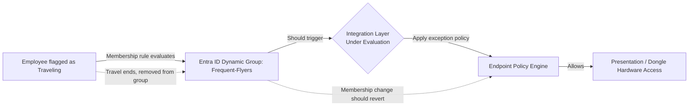

# Dynamic Access Provisioning for Traveling Employees

**Status: 🔄 In Progress, Design & Feasibility Phase**

---

## Overview

Designing a scalable model to automatically grant traveling employees temporary elevated device access (for client-site presentation and AV equipment) and automatically revoke that access the moment travel status ends, without manual toggling on either the identity side or the endpoint policy side.

---

## Business Problem

Standard endpoint security policy blocks laptops from connecting to third-party presentation hardware (client-provided AV and display equipment). That's the correct security default, but it creates real friction for employees who travel for client-facing work and need to present on-site using equipment they don't control.

The naive fix, permanently loosening the policy for anyone who *might* travel, is not acceptable from a security posture standpoint. It converts a temporary, justified exception into a standing one, for a population that grows over time and never shrinks.

---

## Objectives

- Grant the specific access exception only for the duration of actual travel
- Remove manual, error-prone toggling (today, someone has to remember to revoke it)
- Build the mechanism to scale across the traveling population, not one user at a time

---

## Architecture Under Evaluation

---

## Design Decision Being Evaluated

**Where should membership and enforcement logic live: Entra ID, or the endpoint policy engine?**

- **Proposed model:** a dynamic Entra ID group (`Frequent-Flyers`) using membership rules, so a user is automatically added when they match a defined "traveling" condition and automatically removed once that condition clears.
- **Intended effect:** the Entra group membership change triggers the corresponding endpoint policy exception on that user's device automatically, in both directions (grant on join, revert on leave), with zero manual steps on the endpoint side.

Worth noting: this is the **opposite** design choice from the [AppLocker Isolation project](./AppLocker-Isolation.md), where I deliberately rejected dynamic group membership in favor of a static, human-gated group. That wasn't inconsistency. In an isolation boundary, silent membership drift is the primary risk, so you eliminate automation. In a temporary access grant, *failure to revoke* is the primary risk, so automation is the control. Same platform feature, opposite verdict, because the threat model is inverted.

---

## Open Technical Question (Current Blocker)

Can Entra ID dynamic group membership and the endpoint policy engine be integrated so that a membership change automatically triggers the corresponding endpoint policy state change, without manual intervention?

This requires confirming:

1. Whether the endpoint policy engine can natively query or sync against Entra ID group membership as a targeting condition. It may hit the same **static-group-only platform constraint** I identified during the AppLocker project
2. If native sync isn't supported, what integration path exists: scheduled sync job, webhook/automation trigger, or a scripted bridge reading Entra group changes and pushing corresponding policy updates
3. Whether any sync lag is acceptable for an employee traveling same-day. A 4-hour propagation delay makes the whole design useless for its most common case

---

## Skills Being Developed

- Entra ID dynamic group design (membership rule logic)
- Cross-platform integration thinking, connecting an identity system to a device policy enforcement system
- Feasibility analysis and structured technical escalation, the same discipline applied in the completed AppLocker project

---

## Next Steps

- [ ] Confirm whether the endpoint policy engine can consume Entra dynamic group membership as a targeting source
- [ ] If not, evaluate a scripted/automation bridge (Entra membership change → trigger → policy engine API call)
- [ ] Measure actual propagation lag end to end before committing to the design
- [ ] Loop in security engineering once a technical path is identified
- [ ] Document final architecture and implementation once the approach is confirmed

*This write-up will be updated as design decisions are finalized and implementation begins.*
