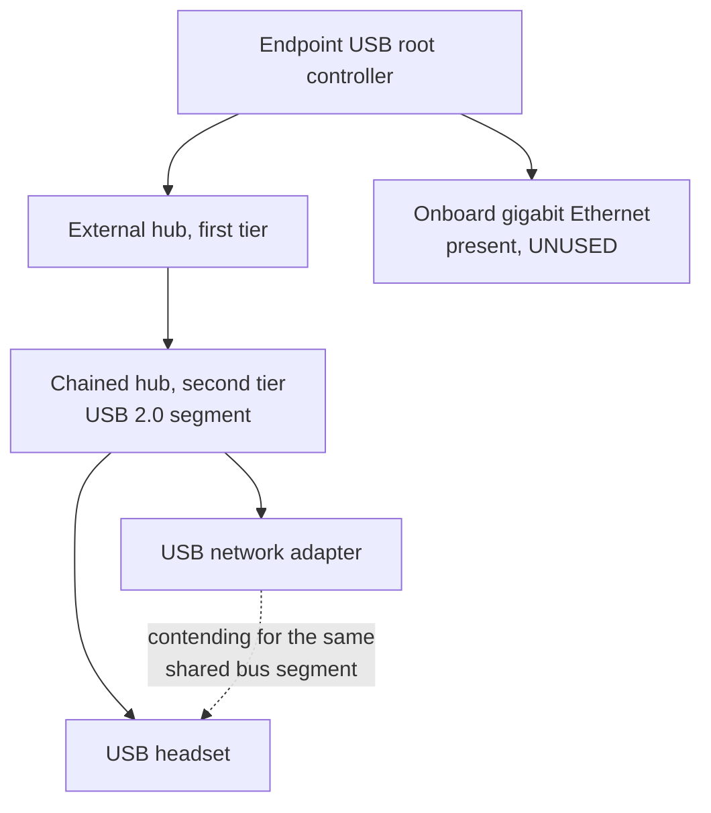

# VDI Session Degradation: All-Day Audio Dropouts and Session Lag
### An endpoint diagnostic that ended in a hypothesis, not a fix

**Status:** Investigated, hypothesis formed, not yet confirmed. Open, and the symptom class has recurred since.
**Domain:** Endpoint Diagnostics · VDI · USB Bus Topology · Windows Event Log Analysis

> *Note on detail level: the hostname, network identifiers, hardware model and chipset identifiers, and vendor product versions are omitted. Security and management tooling is described by function rather than product. The reasoning and the sequence are unchanged from the real investigation.*

---

## Summary

A user reported audio dropouts and general session sluggishness inside their VDI session, persisting all day rather than clustering around a meeting or a specific application. The issue had already survived the entire standard tier-1 path, so the useful work was not another reset. It was working out which layer was actually degrading.

I ruled out endpoint health as a cause using event log evidence, then reconstructed the endpoint's USB device topology from power report port paths. That reconstruction showed the USB network adapter and the USB headset sharing a single USB 2.0 hub segment, two hops behind a chained hub, while an onboard gigabit Ethernet port sat unused.

That is a plausible and testable explanation for both symptoms at once. It is not a confirmed one, and this write-up says so, because the diagnostic bundle I collected could not measure the thing that would prove it.

---

## Why This One Is Worth Writing Up

Most of the tickets I resolve end in a fix. This one ended in a well-supported hypothesis and an explicit statement of what I could not determine, which is a more honest reflection of how real diagnostic work goes.

It is also the clearest example I have of a specific habit: when two apparently unrelated symptoms appear together and neither responds to the obvious fixes, the thing worth looking for is a **shared dependency** rather than two separate faults. Audio quality and session responsiveness have no obvious relationship to each other. They do if both are contending for the same physical bus.

---

## This Was Not An Isolated Report

The investigation below covers one endpoint, but the same symptom class has come in from multiple users over a multi-week period since, across both internal staff and staff working into a partner health system environment. The reported variants:

- Audio dropping out mid-call, or degrading to unusable, inside an otherwise working session
- One-way and no-way audio, where the call connects and the device passes every in-client test but neither party can hear the other
- Audio routing to the wrong output device entirely, playing through onboard speakers instead of the headset
- Sessions failing to connect or hanging in a restoring state, sometimes clearing after repeated restarts
- General session lag and slow application load, frequently reported alongside the audio complaints rather than separately
- Calls dropping in step with secure web gateway client disconnects

Most of these resolve with standard remediation. The ones that don't are the interesting population, and this write-up came out of one of them.

**The useful conclusion from the pattern is that it is not one fault.** Grouping every "VDI is bad today" report into a single bucket hides at least three distinct classes: endpoint-local peripheral and bus problems, session broker and connection-state problems, and network-path problems. They present almost identically to the user and have completely different fixes. Sorting an incoming report into the right class before troubleshooting is worth more than any individual fix in this document.

---

## Objective

Determine whether the reported degradation originated in the VDI session, the network path, the endpoint's operating system health, or the endpoint's physical hardware configuration, and produce evidence strong enough for whoever picked it up next to act on rather than start over.

---

## Environment & Constraints

| Item | Detail |
|---|---|
| Symptom | Audio dropouts plus general session lag inside a VDI session, persistent across a full working day |
| Prior work | The standard tier-1 path had already been exhausted without improvement |
| Peripherals | USB headset and USB network adapter, both connected through external hubs |
| Onboard connectivity | Gigabit Ethernet port present and unused |
| Evidence available | Endpoint diagnostic bundle: Windows event logs, power configuration report, device topology data |
| Evidence not available | Per-port USB bus utilization, USB error and retry counters, timestamped network throughput to correlate against dropout times |
| Constraint | Remote user. No physical access to reseat, reroute, or swap hardware during the investigation |

---

## Method

I worked the elimination order deliberately rather than by instinct, cheapest and most conclusive first:

1. **Endpoint health before endpoint hardware.** If the machine was crashing, thrashing memory, throttling under a power policy, or fighting its own management agents, that explains sluggishness on its own and makes any hardware theory unnecessary. Event logs answer this quickly and definitively, so it goes first.
2. **Hardware topology only after health was clean.** Reconstructing a USB tree is slower work and only worth doing once the simpler explanations are gone.
3. **State the limits of the evidence at the end.** A hypothesis handed over as a conclusion wastes the next person's time when it turns out to be wrong.

---

## Investigation Log

### Phase 1: Scope the symptom

| Step | Action | Finding |
|---|---|---|
| 1.1 | Established the pattern | Degradation was all-day and continuous, not tied to a specific application, meeting, or time of day. This argues against a single misbehaving app and toward something environmental |
| 1.2 | Confirmed tier-1 was genuinely exhausted | The standard reset and reconnect path had been completed already. Repeating it would have produced no new information |
| 1.3 | Noted the symptom pair | Two symptoms, audio quality and session responsiveness, with no obvious relationship. Treated this as the most useful clue rather than as two separate tickets |

### Phase 2: Rule out endpoint health from event logs

Each of these was checked to be eliminated, not to be confirmed. Ruling a cause out is a result, and documenting it is what stops the next person repeating the work.

| Candidate cause | Verdict |
|---|---|
| Application or system crashes | Ruled out. No crash pattern corresponding to the reported degradation window |
| Storage faults | Ruled out. No disk error or retry events that would explain latency |
| Memory pressure | Ruled out. No evidence of exhaustion or excessive paging |
| Power throttling | Ruled out. Power configuration did not indicate a policy capping performance during the affected period |
| Management or security agent interference | Ruled out. No indication that the endpoint management agent or the endpoint protection agent was consuming resources or blocking in a way that matched the symptom timing |

With all five gone, an operating-system-level explanation looked unlikely, which is what justified moving to physical configuration.

### Phase 3: Reconstruct the USB topology

The diagnostic bundle did not contain a device tree directly, but the power configuration report lists USB device port paths. Those paths encode the hub chain, so the physical topology can be rebuilt from them.

| Step | Action | Finding |
|---|---|---|
| 3.1 | Extracted port paths | Rebuilt the hub chain from the port path values in the power report |
| 3.2 | Mapped device placement | Both the network adapter and the headset resolved to the same second-tier hub, two hops from the root controller |
| 3.3 | Identified the segment type | That shared segment was USB 2.0, so both devices were sharing a single 480 Mbps half-duplex bus rather than each having dedicated bandwidth |
| 3.4 | Noted the unused onboard port | The endpoint had an onboard gigabit Ethernet port that was not in use, meaning all network traffic was being pushed through the same bus segment carrying the audio stream |

---

## Hypothesis

USB audio is isochronous. It reserves bus bandwidth and has no retry mechanism, so when a shared segment is saturated the audio does not slow down, it drops. Network adapter traffic is bursty by nature. A VDI session generates continuous bidirectional traffic.

Putting an isochronous audio device and a bursty network device on the same USB 2.0 segment, two hops behind a chained hub, is therefore a credible single cause for both reported symptoms at once: the audio drops when the bus is contended, and the session feels sluggish because its network path is contending for the same segment.

The unused onboard gigabit port makes this both more likely and easier to test, because moving network traffic off the USB bus entirely costs nothing and requires no new hardware.

---

## What I Could Not Confirm

This is the part that decides whether the write-up above is useful or misleading, so it belongs in the document rather than in a footnote.

**The bundle I collected cannot prove the hypothesis.** Specifically, it does not contain:

- **Per-port bus utilization.** Establishing contention requires knowing the segment was actually saturated, not just that it could be.
- **USB error and retry counters.** These would show whether transfers were genuinely failing on that segment.
- **Timeline correlation.** Without timestamped dropout events matched against network throughput, the relationship stays circumstantial. Two things being on the same bus is not evidence that one starved the other.

**The blind spot in my own collection.** I gathered event logs and configuration state, which answer "is the endpoint healthy" well. I did not gather bus-level telemetry, which is what answers "is this specific segment the bottleneck." Recognizing that gap after the fact is the main thing I took from this ticket. The diagnostic bundle I chose was shaped by the causes I expected, so it could eliminate them, and it could not measure the cause I ended up suspecting.

**No A/B test was possible.** The user was remote, so I could not move the headset to a different controller or switch to the onboard port and observe the result, which is the single cheapest way to confirm or kill the theory.

---

## Recommended Next Steps

Ordered so that the cheapest test that could disprove the hypothesis comes first.

- [ ] **Move network traffic to the onboard gigabit port.** Free, reversible, and removes the suspected contention entirely. If the symptoms persist unchanged, the hypothesis is wrong and the investigation should move on.
- [ ] **Move the headset off the chained hub** to a root controller port, ideally on a separate controller from any high-throughput device.
- [ ] **Capture bus-level telemetry** if the first two steps are inconclusive: per-port utilization and USB error counters during a reproduction window.
- [ ] **Correlate timestamps.** Log dropout times against network throughput to convert a circumstantial link into a measured one.
- [ ] **Revisit the VDI-side and network-path evidence** if all endpoint-side tests come back clean, since eliminating the endpoint would make the remote side the remaining candidate.
- [ ] **Build a triage path for the recurring reports.** Given how often this symptom class arrives, the highest-value output is not fixing one endpoint. It is a short set of questions that sorts an incoming report into endpoint-local, session-state, or network-path before anyone starts resetting things.

---

## Skills Demonstrated

- Windows event log analysis used for structured elimination rather than for keyword hunting
- Reconstructing physical device topology from indirect evidence, in this case USB port paths in a power configuration report
- Recognizing a shared dependency behind two apparently unrelated symptoms
- Distinguishing a hypothesis from a conclusion, and handing over the difference clearly
- Auditing my own evidence collection and naming what it could not measure
- Producing documentation another technician can act on without repeating the eliminated work

---

## Lessons Learned

- **Two unrelated symptoms with one shared dependency is a pattern, not a coincidence.** The instinct to split them into separate tickets would have buried the only useful clue.
- **Ruling a cause out is a result worth writing down.** Five eliminated candidates are the reason the topology work was justified, and undocumented elimination gets repeated by the next person.
- **A diagnostic bundle is shaped by the causes you expect.** Mine was built to test endpoint health and it did that well. It could not test the cause I finished with, and that is a collection design problem rather than bad luck.
- **Naming the blind spot is what makes the rest credible.** A confident wrong answer costs more than an honest incomplete one, particularly on a ticket that has already consumed a user's full working day.
